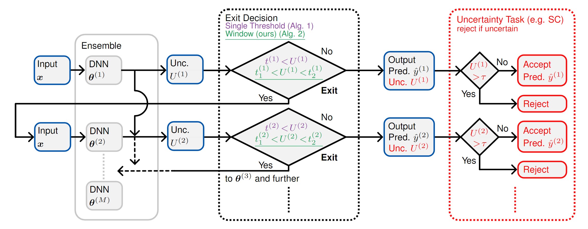
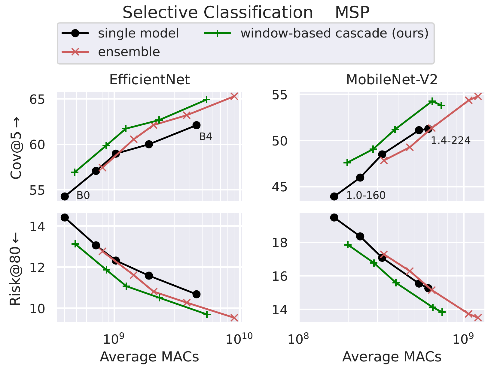

# Window-Based Early-Exit Cascades for Uncertainty Estimation: When Deep Ensembles are More Efficient than Single Models (ICCV 2023)



This repository contains code to reproduce the results in our [paper](https://arxiv.org/abs/2303.08010). If you found either the paper or the code useful please consider citing it:

```bibtex
@InProceedings{Xia_2023_ICCV,
    author    = {Xia, Guoxuan and Bouganis, Christos-Savvas},
    title     = {Window-Based Early-Exit Cascades for Uncertainty Estimation: When Deep Ensembles are More Efficient than Single Models},
    booktitle = {Proceedings of the IEEE/CVF International Conference on Computer Vision (ICCV)},
    month     = {October},
    year      = {2023},
}
```


## ImageNet Results



## Requirements
The main requirements for this repository are:
```
python
pytorch (+torchvision)
pytorch-lightning
numpy
pandas
matplotlib
seaborn
scikit-learn
tqdm
ptflops
```


## Datasets and Setup
The datasets used in our work can be obtained by following the links and/or instructions below.
- [ImageNet](https://www.image-net.org/)
- [OpenImage-O](https://github.com/haoqiwang/vim): download the [test set](https://github.com/cvdfoundation/open-images-dataset) and place the datalist file `utils/openimages_datalist.txt` the level above the directory containing the images.
- [iNaturalist](https://github.com/deeplearning-wisc/large_scale_ood)


After obtaining the data edit `experiment_configs/change_paths.py` such that the dictionary `data_paths` is updated with the correct absolute paths to all the datasets and `RESULTS` points to the directory where you want results (plots and `.csv` files) to be saved. Then run the script to update all the configuration `.json` files.
```bash
cd experiment_configs
python change_paths.py
cd ..
```
## Training
To train all models in order to reproduce our results run:
```bash
cd models
mkdir saved_models
cd ..
cd experiment_scripts
chmod +x *
./train_ensembles.sh
cd ..
``` 
Note that the configs by default use 8 GPUs. To use fewer GPUs change the field `"gpu_id"` in the corresponding `.json` config file or pass the desired GPU indices to the command line argument `--gpu`. An example of training a single model:
```bash
python train_lightning.py \
    experiment_configs/efficientnetb2_imagenet.json \
    --seed 9 --gpu 23 --amp 1 --slurm 0
```
## Testing
After training, the saved model weights should be in `models/saved_models`. To evaluate all models run
```bash
cd experiment_scripts
chmod +x *
./test_cascades.sh
cd ..
```
This will run inference, cache logits, then evaluate cascade performance in both directions. An example of evaluating a single cascade would be:
```bash
python test.py \
    experiment_configs/efficientnetb2_imagenet.json \
    --seed 1 --gpu 1
python test.py \
    experiment_configs/efficientnetb2_imagenet.json \
    --seed 2 --gpu 1
python cascade_results.py \
    experiment_configs/efficientnetb2_imagenet.json \
    --seeds 12  \
    --strategy_func window_threshold_strategy \
    --exit_metric confidence --unc_task cov@5
```
Note that in this repository Maximum Softmax Probability (MSP) is aliased to "confidence". `test.py` only supports evaluation on a single GPU.


To obtain the plots from the main results in our paper run 
```bash
cd experiment_scripts
./plot_main_results.sh
cd ..
```
An example of a single plot:
```bash
python plot_unc_macs_comparison.py \
    experiment_configs/efficientnetb0_imagenet.json \
    --model_family efficientnet \
    --seeds 12 \
    --unc_task risk@80 \
    --exit_metric confidence \
    --strategy_func window_threshold_strategy \
    --ood_data openimage-o
```
To measure and plot throughput and latency run
```bash
cd experiment_scripts
./efficientnet_lat_throughput.sh
cd ..
```
Note that this needs to be run after the main evaluation as it uses values from the `.csv` files generated.

To obtain the MSDNet results in our paper first download the publically available weights from https://github.com/kalviny/MSDNet-PyTorch. Rename the `models` folder to `msdnet_pretrained` and place it inside `models/saved_models`. Then run
```bash
cd experiment_scripts
./msdnet_eval.sh
cd ..
``` 
